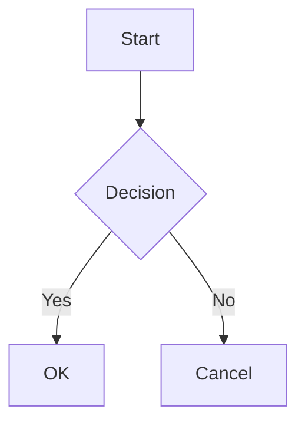
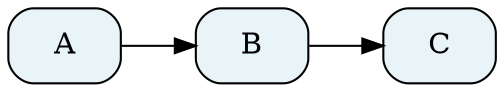
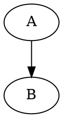

# MarkdownRender

A native macOS command-line tool that renders Markdown files in a beautiful window with support for Mermaid diagrams and Graphviz graphs.

## Features

- **Native macOS window** - Lightweight AppKit window with WebKit rendering
- **Mermaid diagrams** - Flowcharts, sequence diagrams, state diagrams, and more
- **Graphviz/DOT support** - Full DOT language support including colors, shapes, clusters, and styling
- **Syntax highlighting** - Code blocks with language-aware highlighting
- **Dark/light mode** - Follows system appearance or manual override
- **Live reload** - Watch mode for automatic refresh on file changes
- **Keyboard shortcuts** - Cmd+R (reload), Cmd+W (close), Cmd+±0 (zoom)

## Installation

### Build from source

Requires Xcode command-line tools and Swift 5.9+.

```bash
# Clone and build
git clone <repo-url>
cd MarkdownRender
swift build -c release

# Copy to your bin directory
cp .build/release/MarkdownRender ~/bin/
```

## Usage

```bash
# Basic usage
MarkdownRender path/to/file.md

# Watch for changes (live reload)
MarkdownRender --watch path/to/file.md

# Force dark or light theme
MarkdownRender --theme dark path/to/file.md
MarkdownRender --theme light path/to/file.md

# Show help
MarkdownRender --help
```

## Markdown Features

Standard CommonMark syntax is supported, plus:

### Mermaid Diagrams

````markdown

````

### Graphviz/DOT Graphs

````markdown

````

Or use `graphviz` as the language identifier:

````markdown

````

### Supported Graphviz Features

- All node shapes (box, circle, diamond, cylinder, etc.)
- Cluster subgraphs with custom styling
- Edge styles (solid, dashed, dotted, bold)
- Colors (fill, border, font)
- HTML-like labels with tables
- Multiple layout engines

## Project Structure

```
MarkdownRender/
├── Package.swift                 # Swift Package Manager manifest
├── Sources/MarkdownRender/
│   ├── main.swift               # CLI entry point
│   ├── App/
│   │   └── AppDelegate.swift    # Window and app lifecycle
│   └── Rendering/
│       ├── MarkdownParser.swift # Markdown to HTML conversion
│       └── HTMLGenerator.swift  # HTML template and CSS
└── sample.md                    # Example markdown file
```

## Dependencies

- [swift-markdown](https://github.com/apple/swift-markdown) - Apple's CommonMark parser
- [swift-argument-parser](https://github.com/apple/swift-argument-parser) - CLI argument parsing
- [Mermaid.js](https://mermaid.js.org/) - Diagram rendering (CDN)
- [Viz.js](https://viz-js.com/) - Graphviz rendering (CDN)
- [Highlight.js](https://highlightjs.org/) - Syntax highlighting (CDN)

## Requirements

- macOS 13.0 (Ventura) or later
- Internet connection (for CDN-hosted JavaScript libraries)

## License

MIT
