# Graphviz Advanced Styling Test

Testing complex Graphviz features including colors, line styles, shapes, clusters, and more.

## System Architecture Diagram

## State Machine with Colors

## Network Topology

## Entity Relationship Diagram

```dot
digraph ERD {
    rankdir=LR;
    fontname="Helvetica";
    node [shape=none, fontname="Helvetica"];
    edge [fontname="Helvetica", fontsize=9];

    users [label=<
        <TABLE BORDER="0" CELLBORDER="1" CELLSPACING="0" CELLPADDING="6">
            <TR><TD BGCOLOR="#3498db" COLSPAN="2"><FONT COLOR="white"><B>Users</B></FONT></TD></TR>
            <TR><TD ALIGN="LEFT">🔑 id</TD><TD ALIGN="LEFT">UUID</TD></TR>
            <TR><TD ALIGN="LEFT">email</TD><TD ALIGN="LEFT">VARCHAR(255)</TD></TR>
            <TR><TD ALIGN="LEFT">name</TD><TD ALIGN="LEFT">VARCHAR(100)</TD></TR>
            <TR><TD ALIGN="LEFT">created_at</TD><TD ALIGN="LEFT">TIMESTAMP</TD></TR>
        </TABLE>
    >];

    orders [label=<
        <TABLE BORDER="0" CELLBORDER="1" CELLSPACING="0" CELLPADDING="6">
            <TR><TD BGCOLOR="#2ecc71" COLSPAN="2"><FONT COLOR="white"><B>Orders</B></FONT></TD></TR>
            <TR><TD ALIGN="LEFT">🔑 id</TD><TD ALIGN="LEFT">UUID</TD></TR>
            <TR><TD ALIGN="LEFT">🔗 user_id</TD><TD ALIGN="LEFT">UUID</TD></TR>
            <TR><TD ALIGN="LEFT">status</TD><TD ALIGN="LEFT">ENUM</TD></TR>
            <TR><TD ALIGN="LEFT">total</TD><TD ALIGN="LEFT">DECIMAL</TD></TR>
            <TR><TD ALIGN="LEFT">created_at</TD><TD ALIGN="LEFT">TIMESTAMP</TD></TR>
        </TABLE>
    >];

    products [label=<
        <TABLE BORDER="0" CELLBORDER="1" CELLSPACING="0" CELLPADDING="6">
            <TR><TD BGCOLOR="#9b59b6" COLSPAN="2"><FONT COLOR="white"><B>Products</B></FONT></TD></TR>
            <TR><TD ALIGN="LEFT">🔑 id</TD><TD ALIGN="LEFT">UUID</TD></TR>
            <TR><TD ALIGN="LEFT">name</TD><TD ALIGN="LEFT">VARCHAR(200)</TD></TR>
            <TR><TD ALIGN="LEFT">price</TD><TD ALIGN="LEFT">DECIMAL</TD></TR>
            <TR><TD ALIGN="LEFT">stock</TD><TD ALIGN="LEFT">INTEGER</TD></TR>
        </TABLE>
    >];

    order_items [label=<
        <TABLE BORDER="0" CELLBORDER="1" CELLSPACING="0" CELLPADDING="6">
            <TR><TD BGCOLOR="#e74c3c" COLSPAN="2"><FONT COLOR="white"><B>Order Items</B></FONT></TD></TR>
            <TR><TD ALIGN="LEFT">🔑 id</TD><TD ALIGN="LEFT">UUID</TD></TR>
            <TR><TD ALIGN="LEFT">🔗 order_id</TD><TD ALIGN="LEFT">UUID</TD></TR>
            <TR><TD ALIGN="LEFT">🔗 product_id</TD><TD ALIGN="LEFT">UUID</TD></TR>
            <TR><TD ALIGN="LEFT">quantity</TD><TD ALIGN="LEFT">INTEGER</TD></TR>
            <TR><TD ALIGN="LEFT">price</TD><TD ALIGN="LEFT">DECIMAL</TD></TR>
        </TABLE>
    >];

    // Relationships
    users -> orders [label="1:N", style=bold, color="#3498db"];
    orders -> order_items [label="1:N", style=bold, color="#2ecc71"];
    products -> order_items [label="1:N", style=bold, color="#9b59b6"];
}
```

## Simple Decision Tree

