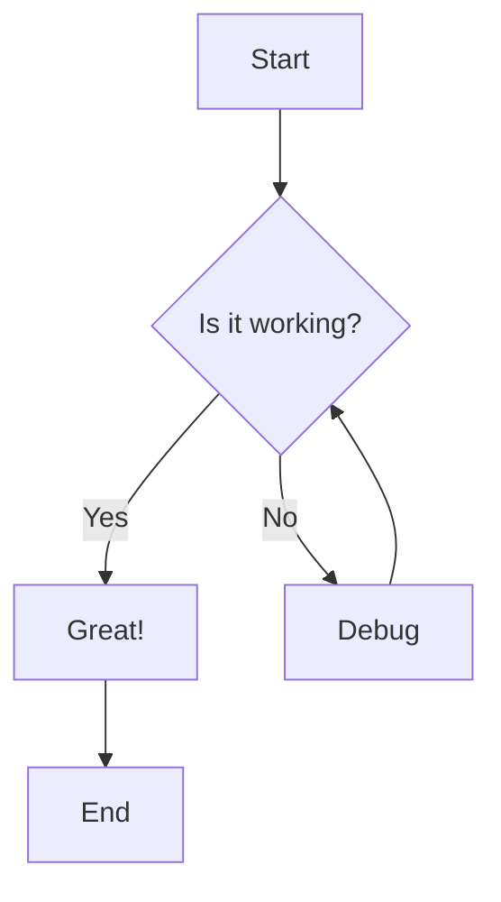
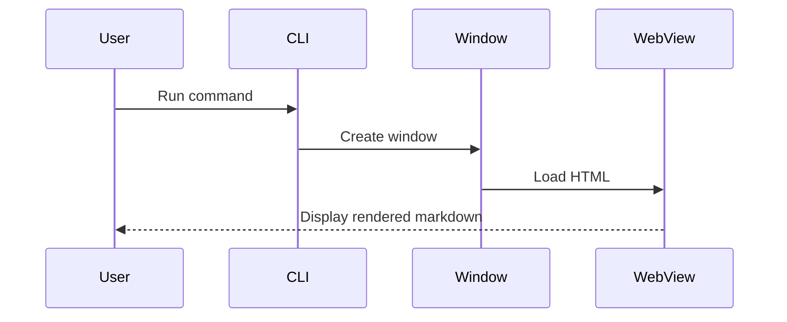
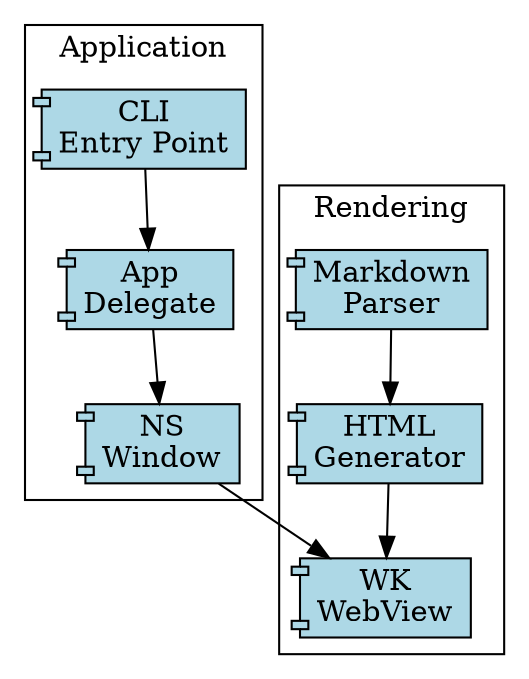

# Welcome to MarkdownRender

A beautiful macOS markdown renderer with **Mermaid** and **Graphviz** support.

## Features

- Native macOS window with WebKit rendering
- Automatic dark/light mode support
- Live file watching with `--watch` flag
- Syntax highlighting for code blocks

## Code Example

Here's some Swift code:

```swift
func greet(name: String) -> String {
    return "Hello, \(name)!"
}

let message = greet(name: "World")
print(message)
```

## Mermaid Diagrams

### Flowchart



### Sequence Diagram



## Graphviz Diagrams

### Simple Graph


### Component Diagram



## Tables

| Feature | Status | Notes |
|---------|--------|-------|
| Markdown | ✅ | Full CommonMark support |
| Mermaid | ✅ | Flowcharts, sequences, etc. |
| Graphviz | ✅ | DOT language support |
| Dark Mode | ✅ | Follows system preference |

## Blockquotes

> "The best way to predict the future is to invent it."
> — Alan Kay

## Task Lists

- [x] Create CLI entry point
- [x] Set up NSWindow
- [x] Implement markdown parsing
- [x] Add Mermaid support
- [x] Add Graphviz support
- [ ] Add PDF export
- [ ] Add print support

---

*Built with Swift, AppKit, and WebKit*
